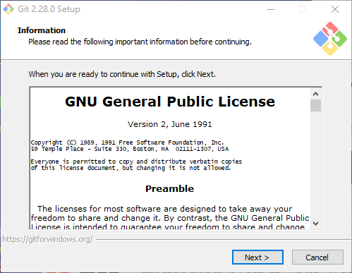
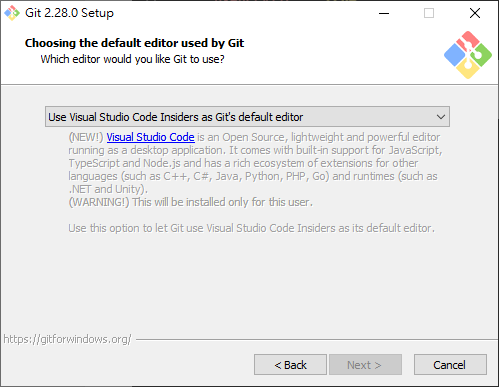
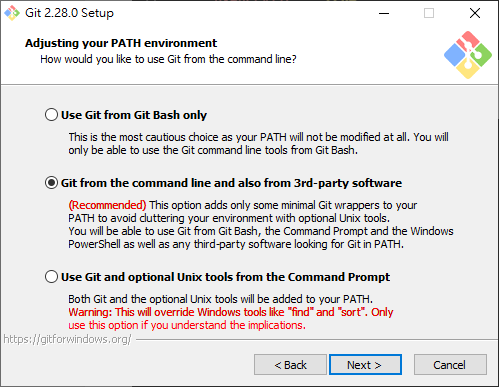
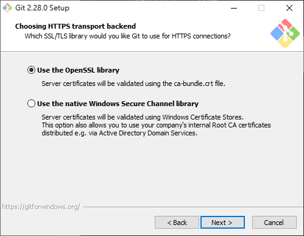
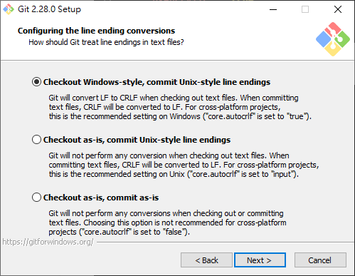
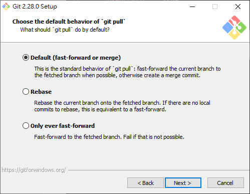
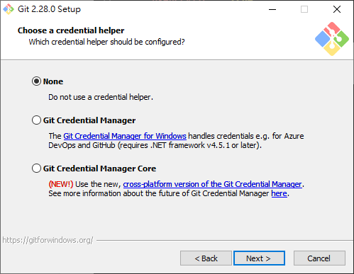
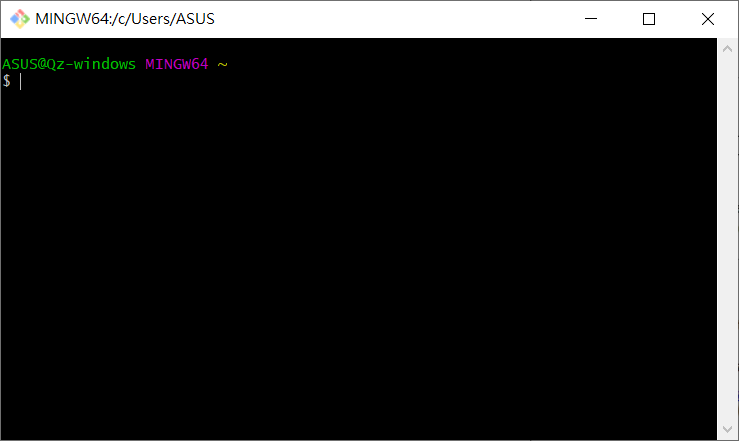
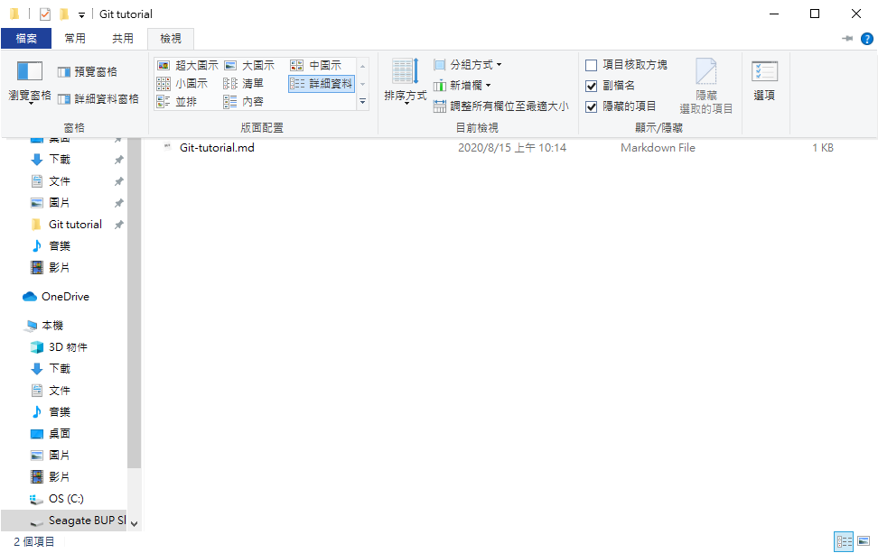

# Install Git

# Optional Setup

# Command Line Interface (CLI) Basics

-   hostname
-   `<tab>`
-   `<ctrl><c>`
-   `help <cmd>`
-   [`PATH`](https://www.java.com/zh_TW/download/help/path.xml)
-   `$`

## File, Directory, Path, Wildcard

-   `.`
-   `..`
-   `*.txt`
-   `path/to/file`
-   absolute path, relative path

## Filesystem, Navigation

-   `dir` / `ls`
-   `cd`
-   `mkdir`
-   `clear`
-   `pwd`
-   **windows** `explorer .`

## Command, Option, Argument

`<>`: mandatory

`[]`: optional

`...`: repeatable

Keywords are sperated by **whitespace**

Line of command: `<cmd> [FLAG_LIST] [ARG_LIST]`

`FLAG_LIST`: `[FLAG [FLAG...]]`

`FLAG`: `-f`, `-f flag-arg`, `--flag-name`, `--flag-name flag-arg`

`ARG_LIST`: `[arg [arg...]]`

# Setup Git

[Git Book - Getting Started - First-Time Git Setup](https://git-scm.com/book/en/v2/Getting-Started-First-Time-Git-Setup)

[VS Code as Git editor](https://code.visualstudio.com/docs/editor/versioncontrol#_vs-code-as-git-editor)

`git config --global user.name "John Doe"`

`git config --global user.email johndoe@example.com`

git config for `--gloabl` vs pre project

# What and Why

[Git Book - Getting Started - About Version Control](https://git-scm.com/book/en/v2/Getting-Started-About-Version-Control)

-   Version Control System
-   Distributed Version Control Systems
-   Git tracks your files
-   Branching
-   Cooperation
-   Time Traveling - **checkout**
-   Who did what, what is changed

# Git Basics

`git <cmd> --help`

`git init`

_.git/_

## Working Directory, Stage, Commit

[Git Book - Git Basics - Recording Changes to the Repository](https://git-scm.com/book/en/v2/Git-Basics-Recording-Changes-to-the-Repository)

working directory / working copy

staging area / cache

commit

`git status`

`git add <file>` / `git add .`

`git diff`, `git diff --cached`

`git commit`

​ a commit is the **changes** to its previous commit

`git show [commit]`

`git log`

# Branching

[Learn Git Branching](https://learngitbranching.js.org/)

`git branch`

`git merge`

## Checkout, HEAD, Branch, Ref

`git checkout`

`HEAD` is a pointer to which the commit you are checking out

a branch is a pointer to **a commit**

# Change the History

`git commit --amend`

## Reset vs Revert

## Rebase

# .gitignore

## To Track or Not To Track:

    - if the history of a file matters? if two versions of the file comparable?
    - if the file is humen readable?
    - if the file is for the project?

# Team Collaboration with Git Server

`git clone`

## Local Branch, Remote Branch

`git fetch`, `git pull`

`git push`

# Extra Tools

-   vscode extension - [GitLens](https://github.com/eamodio/vscode-gitlens)
-   [Sourcetree](https://www.sourcetreeapp.com/)
